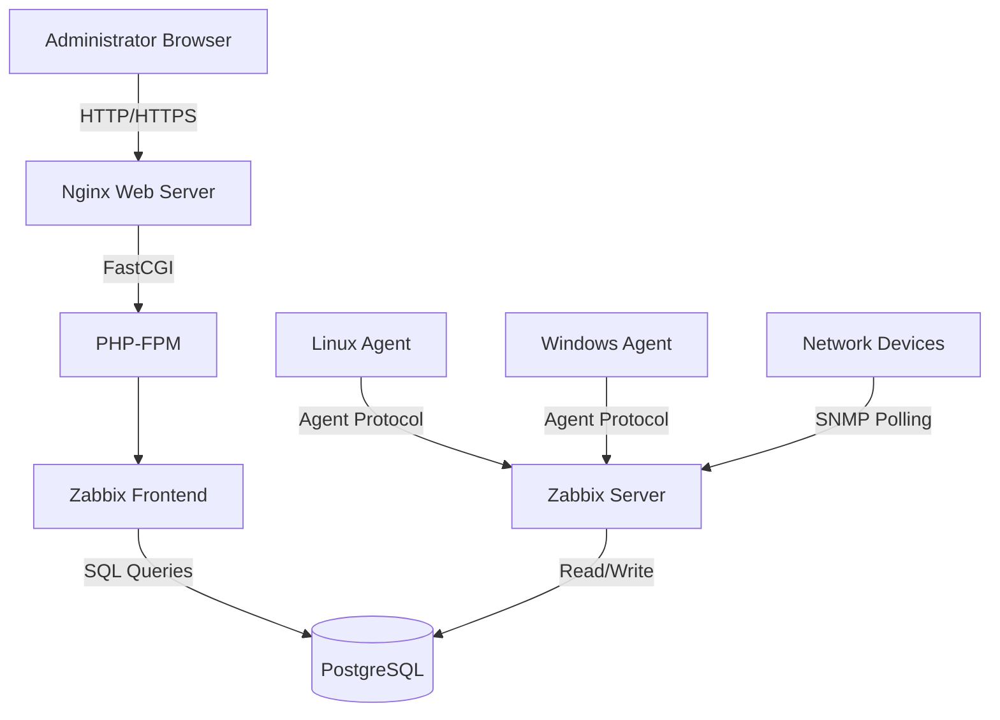
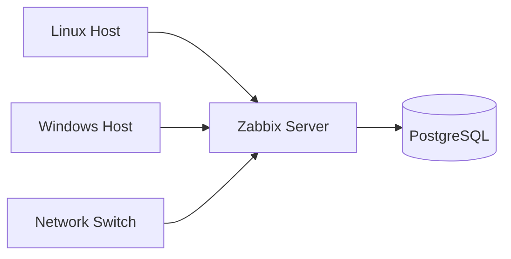

# System Architecture

## Overview

This document describes the architecture of the monitoring platform deployed in this project.

The deployment consists of six major components working together:

- Browser
- Nginx
- PHP-FPM
- Zabbix Frontend
- Zabbix Server
- PostgreSQL Database

In addition, monitored hosts communicate directly with the Zabbix Server using the Zabbix Agent protocol.

---

# High-Level Architecture



---

# Component Responsibilities

## Browser

The browser provides access to the Zabbix Web Interface.

Users perform tasks such as:

- Logging into the dashboard
- Creating hosts
- Viewing monitoring data
- Managing users
- Creating dashboards
- Configuring alerts

The browser never communicates directly with PostgreSQL or the Zabbix Server.

---

## Nginx

Nginx acts as the web server.

Responsibilities:

- Accept HTTP requests
- Serve static files
- Forward PHP requests to PHP-FPM
- Improve performance through efficient request handling

Nginx does not execute PHP code.

---

## PHP-FPM

PHP-FPM is responsible for executing PHP scripts.

Responsibilities:

- Execute Zabbix frontend code
- Process user requests
- Query PostgreSQL
- Generate HTML pages
- Return responses to Nginx

Without PHP-FPM, the frontend cannot function.

---

## Zabbix Frontend

The frontend is the web application written in PHP.

It provides:

- Login page
- Dashboard
- Host management
- Trigger management
- User management
- Monitoring visualization

The frontend stores and retrieves data from PostgreSQL.

---

## PostgreSQL

PostgreSQL stores all persistent data.

Examples include:

- Users
- Hosts
- Templates
- Items
- Triggers
- Historical metrics
- Events
- Alerts

No monitoring data is stored directly by the frontend.

---

## Zabbix Server

The Zabbix Server is the core of the monitoring platform.

Responsibilities:

- Poll monitored hosts
- Receive agent data
- Evaluate triggers
- Generate alerts
- Store monitoring data
- Execute discovery rules
- Schedule internal tasks

The server continuously communicates with PostgreSQL.

---

## Zabbix Agent

Agents are installed on monitored systems.

Responsibilities:

- Collect CPU usage
- Collect Memory usage
- Monitor Disk usage
- Monitor Network traffic
- Execute UserParameters
- Send metrics to Zabbix Server

---

# Request Flow

When a user opens the dashboard, the following sequence occurs:

```text
Browser
    │
    ▼
Nginx
    │
    ▼
PHP-FPM
    │
    ▼
Zabbix Frontend
    │
    ▼
PostgreSQL
```

The generated HTML page then travels back:

```text
PostgreSQL
    │
    ▼
PHP-FPM
    │
    ▼
Nginx
    │
    ▼
Browser
```

---

# Monitoring Data Flow

Monitoring traffic follows a completely different path.



Notice that monitored hosts never communicate with the web frontend.

---

# Storage Architecture

The PostgreSQL database is stored on a dedicated Logical Volume.

```text
Physical Disk (/dev/sdb)

        │

        ▼

Volume Group (vg_data)

        │

        ▼

Logical Volume (lv_pgsql)

        │

        ▼

ext4 Filesystem

        │

        ▼

/var/lib/postgresql
```

This design separates database storage from the operating system partition.

Benefits include:

- Easier storage expansion
- Better data isolation
- Simpler backup strategy
- Improved maintainability

---

# Service Dependencies

The services depend on each other in the following order:

```text
PostgreSQL
      │
      ▼
Zabbix Server
      │
      ▼
PHP-FPM
      │
      ▼
Nginx
      │
      ▼
Browser
```

If PostgreSQL is unavailable, the Zabbix Server cannot start correctly.

If PHP-FPM is unavailable, the web interface becomes inaccessible.

If Nginx is unavailable, users cannot access the frontend even though the Zabbix Server may continue monitoring hosts.

---

# Security Considerations

This deployment follows several good practices:

- Dedicated database storage
- Service separation
- UUID-based filesystem mounting
- Database user isolation
- systemd service management
- Minimal service exposure

Future improvements may include:

- HTTPS with TLS certificates
- Firewall hardening
- SELinux/AppArmor policies
- Reverse proxy authentication
- High Availability deployment

---

# Key Takeaways

- Zabbix Server and Zabbix Frontend are independent components.
- Nginx never executes PHP directly.
- PHP-FPM is responsible for executing frontend code.
- PostgreSQL stores all monitoring data.
- LVM provides flexible storage management.
- Separating infrastructure layers simplifies troubleshooting.